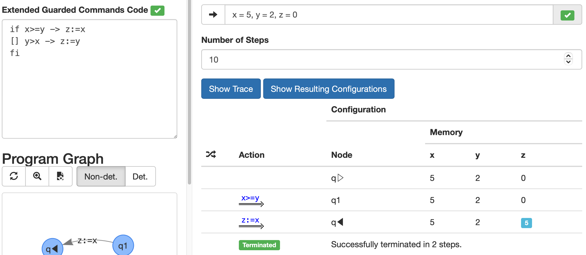

# Task 3: An Interpreter for GCL

> **Deadline: March 18, 23:59**
>
> You must submit your solutions by pushing them to the git repository assigned to your group.
> The last push before the deadline will be considered as your submission. 

The detailed rules of the mandatory assignment are found [here](README.md).

NOTE: ensure that the main branch of your repository is updated with:

- MacOS, Linux: `./update.sh`
- Windows: `update.ps1`


## Goals

The goal of this task is to implement an interpreter
that executes a GCL program on a given input memory step by step, similarly to the environment `Step-wise Execution` on [formalmethods.dk/fm4fun](http://www.formalmethods.dk/fm4fun/) and `Interpreter` on `Inspectify`.

For example, the screenshot below depicts the (complete) execution sequence computed for a program that assigns to `z` the maximum of `x` and `y` for an initial memory in which `x` is assigned to `5`, `y` is assigned to `2` and `z` is assigned to `0`.
After taking two actions, we reach the final node, i.e. execution successfully terminates, and the final memory assigns `5` to `z`.



## Detailed Description

> **Relevant files in your group's repository:** 
> 
> `Interpreter.fs`

Your task is to implement the function
```
let analysis (input: Input) : Output = // TODO
```
The above function `analysis` takes as input 
- a [GCL program](gcl.md),
- a flag indicating whether the program is deterministic or not,
- an initial memory, and 
- an integer `trace_length`.

As an output, the function should produce an execution sequence of length `trace_size` that starts in the initial node of the program's program graph and the provided initial memory. 
If no execution sequence of length `trace_length` exists, the function should produce an execution sequence that is complete or gets stuck.

More precisely, the function must produce an output with the following information:
- `initial_node`: the name of the initial node in the program graph.
- `final_node`: the name of the final node in the program graph.
- `dot`: a string with the dot code of the program graph as in task 2.
- `trace`: a list of execution steps following the initial configuration; as illustrated in the screenshot of FM4FUN above, every step consists of an action, a node in the program graph, and a program memory.
- `termination`: an indicator of how the computed execution sequence of length `trace_length` can be continued. It must be set to `Stuck` if the execution sequence got stuck within `trace_length` execution steps, `Terminated` if the produced execution sequence is complete, and `Running` otherwise.

The exact definitions of the types `Input` and `Output` are found in the file `Io.fs`, which you are *not* allowed to modify.

Launch inspectify as usual:

```
# On Windows
inspectify.ps1 --open
# On macOS and Linux
./inspectify.sh --open
```

Once inspectify has opened in your browser, click on `Interpreter` and start working on your task.


## Hints

It is highly recommended to first make a plan of what functions you will have to implement and how they should interact with each other.

We recommend following [Formal Methods, Chapter 1.2] and [Formal Methods, Chapter 2.3] to build an interpreter based on the semantics of GCL programs and their program graphs:
* You are writing an interpreter for program graphs [Formal Methods, Chapter 1.2], but of course such graphs are generated from GCL programs and that is why you need [Formal Methods, Chapter 2.3].
* Definition 1.11 defines the concept of execution steps. You will most likely need to implement a function to perform such execution steps.
* Definition 1.11 relies on the semantic function `S`, which specifices how the memory is affected by actions (labels in the program graph). You will need to have a look at Definition 2.17, which defines the semantic function for GCL actions. This will in turn require you to implement the functions to evaluate arithmetic and boolean expressions [Formal Methods, Chapter 2.3].
* Definition 1.12 defines the concept of execution sequence. The intrepreter needs produce execution sequences of a maximum length.


## Feedback & Evaluation

You can evaluate your solution by comparing the result to the ones provided by the `fm4fun` or `inspectify` tools.

You can also peridically see an evaluation of the last solution that you (and all other groups) have pushed on our [scoreboard](https://checkr.compute.dtu.dk/scoreboard). 
The results are anonymized using the code at the end of your group's repository name.

We encourage you to proactively ask for feedback from the TAs and the teacher.